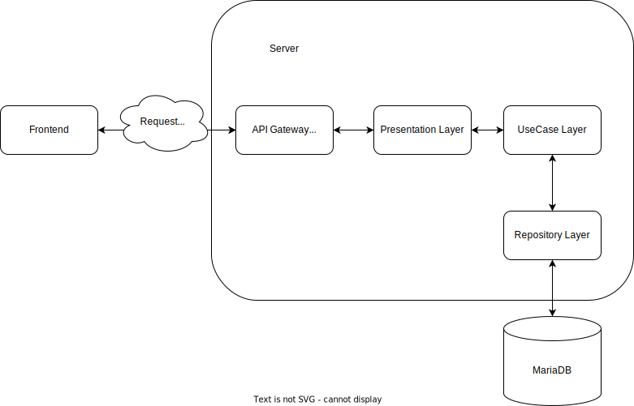

## 開発環境のセットアップ方法

### ツール類のインストール

- `rustup` で Rust ツールチェインをインストールします

```shell
curl --proto '=https' --tlsv1.2 -sSf https://sh.rustup.rs | sh
```

- `cargo-make`と `sea-orm-cli` を `cargo` でインストールします

```shell
cargo install cargo-make sea-orm-cli
```

### ローカルで起動する

データベース周りの接続情報は [.env.example](./server/.env.example) にまとまっており、 DB を起動するためには `.env` ファイルが必要なため、ファイルをコピーします。
必要に応じて値を書きかえてください。

データーベースとサーバーを起動するにはリポジトリのディレクトリトップで `up` タスクを実行します。

```shell
seichi-portal-backend> makers up
```

## アーキテクチャ

クリーンアーキテクチャを採用しています。

- クレート構成

```text
server
├── app
├── domain
├── infra
│  ├── entities
│  └── resource
├── migration
├── presentation
└── usecase
```

### app

サーバーの初期化に必要な操作とサーバーの設定・起動を行うサーバーのエンドポイントです。

### domain

ドメイン（seichi-portal）を表現するのに必要な構造体およびドメイン固有ロジック（構造体の impl）を置くクレートです。
リポジトリのトレイトの定義もここに置きます（リポジトリはドメイン固有型を返す必要があることに注意してください）。

### infra/entities

SeaORM によって生成されたクレートです。
マイグレーションをした場合は、データベースを起動し `makers generate-entity` をすると更新できます。

### infra/resource

外部リソースを扱うクレートです。
主にデータベースのコネクションを持つ `ConnectionPool` にリポジトリトレイトを実装します。

### migration

マイグレーション定義を置くクレートです。
詳しくは SeaORM のドキュメントを参照してください。

### presentation

axum とユースケースをつなぐハンドラーを実装するクレートです。

### usecase

ユースケースを実装するクレートです。

## 新しい API を作る場合の流れ

実装はドメインが先で、その後はデータの流れの逆順に（データベースから）行うのがおすすめです。



1. ドメイン固有型を作る (domain crate)
2. リポジトリトレイトを追加する (domain crate)
3. 必要ならマイグレーションモジュールを作成する (migration crate)
4. マイグレーションを実行して entities を更新する (entities crate)
5. ユースケース層が必要なリポジトリを実装する (resource crate)
6. ハンドラが呼び出すユースケースをユースケース層に作る (usecase crate)
7. axnum のルートにわたすハンドラをプレゼンテーション層に作る (presentation crate)
8. axnum にルートを追加する (app crate)

## 付録 A: cargo make のタスク一覧

ワークスペース内で `cargo make {タスク}` または `makers {タスク}` を実行することで `Makefile.toml` に書かれたタスクを実行することができます。

### リポジトリのディレクトリトップで使えるタスク

|  タスク名  |    実行されるタスク    | 備考                                |
| :--------: | :--------------------: | :---------------------------------- |
|   up-db    |  docker compose up -d  | データベースを立ち上げます          |
| run-server | cd server && cargo run | server/app をビルドして立ち上げます |
|     up     |  up-db -> run-server   | 上記 2 つを順番にやってくれます     |

### cargo ワークスペース共通で使えるタスク

cargo ワークスペースで共通のタスクはワークスペースのトップディレクトリで実行すると、すべてのクレートに対してタスクが実行されます。
各クレートのディレクトリのトップで実行すると各クレートに対してタスクが実行されます。

| タスク名 |                実行されるタスク                 | 備考                                                           |
| :------: | :---------------------------------------------: | :------------------------------------------------------------- |
|   fix    | cargo clippy --fix --allow-dirty --allow-staged | clippy が自動でコードを修正します                              |
|   test   |                cargo nextest run                | nextest によるテストの実行を行います                           |
|   lint   |           cargo clippy -- -D warnings           | clippy によるコードチェックを行います                          |
|  format  |                    cargo fmt                    | rustfmt によるコード整形を行います                             |
|  pretty  | fix -> test -> lint -> format の順に実行します  | 上記 4 つをすべて実行します、push の前に行うことが推奨されます |
