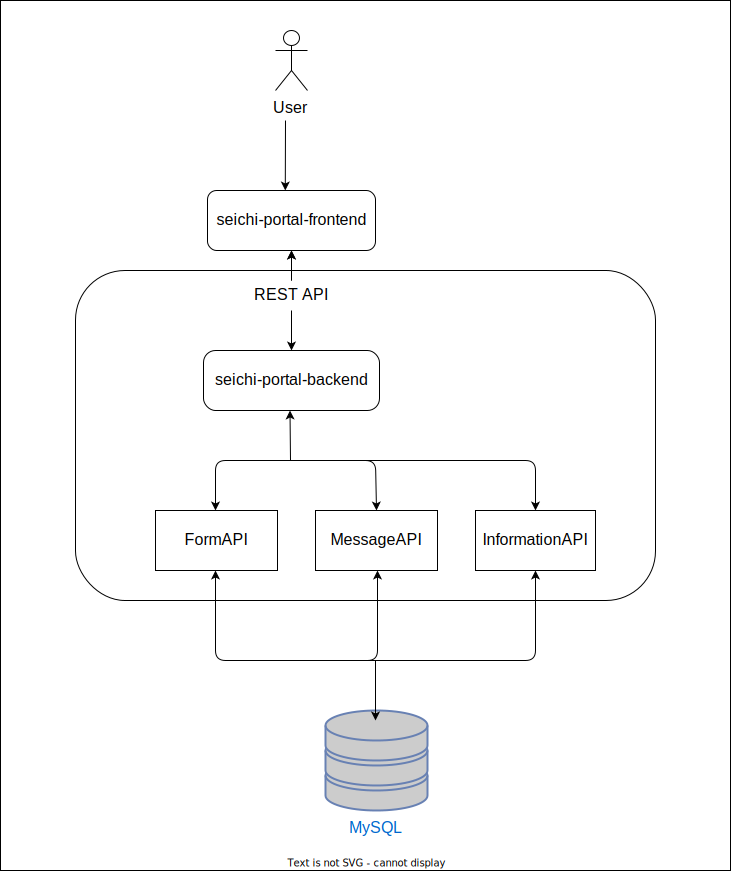

# Seichi Portal

このリポジトリは、Seichi Portalのバックエンド実装です。

プロジェクトの目的やフロントエンドなどの関連リポジトリについては、[こちらのリポジトリ](https://github.com/GiganticMinecraft/seichi-portal)を参照してください。

## 主な機能

| 機能名 | 詳細 |
| --- | --- |
| フォーム機能 | 整地鯖が提供する各種フォームを一元管理する |
| メッセージ機能 | ユーザーから送られてきたフォームのリクエストに対して運営からメッセージを送信できる |
| 情報確認機能 | フォーム回答履歴、処罰履歴、お知らせ情報が確認できる |

## API定義

Seichi Portal ではフロントエンドとバックエンド間の通信に REST API を使っており、API のスキーマは [OpenAPI v3.0.0](https://spec.openapis.org/oas/v3.0.0) ベースの[スキーマ管理用リポジトリ](https://github.com/GiganticMinecraft/seichi-api-schema)に配置し、管理しています。

API 定義は GitHub Pages 上に[公開](https://giganticminecraft.github.io/seichi-api-schema/)しており、すぐに試せるようになっています。

## 開発環境とミドルウェア

バックエンド言語には Rust を採用しており、MySQL にフォームなどの必要な情報が永続化されます。開発環境では Docker Compose を使うため、必要であれば別途導入が必要です。

データベース周りの接続情報は [.env.example](./server/.env.example) にまとまっており、 DB を起動するためには `.env` ファイルが必要なため、以下のようにファイルをコピーします

```bash
cp server/.env{.example,}
```

## プロジェクト俯瞰図



## ライセンス

[Apache Licence 2.0](https://github.com/GiganticMinecraft/seichi-portal-backend/blob/main/LICENSE)
